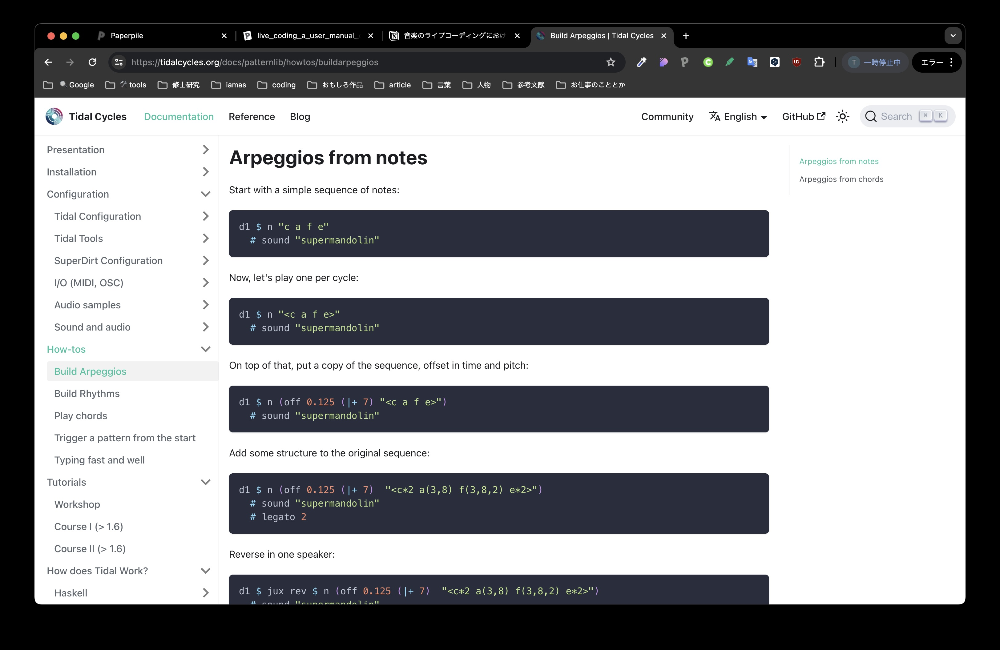

---
head:
  meta:
    - name: 'update'
      content: '2024.7.13'
---

# 音楽のライブコーディングにおけるツールと表現の関係性について(仮)

---

## 7/10

考えの整理

### 研究の出発点

音楽のライブコーディングによる表現がどのように変遷してきたか。その上で音楽的な潮流と技術的な系譜がどう影響を与えているかを知りたい

- ある技術の登場がスタイルや表現を形成してるという技術決定論的な考え
- なぜChucKは音楽のライブコーディングの環境としてかなり初期に登場したにも関わらず、主流なライブコーディングの言語として使われていないのか
- 今あるtidalやsonic piなどがドミナントな影響で、表現もそれに引っ張られたものが現れる？正直なところ、表現したいものはそれぞれ異なるためあまり関係ないようにも思える。

ライブコーディングをやっているパフォーマーとして、個々のアーティストがライブコーディングによって作る音楽にあるオリジナリティがどう存在しているか、それらがどう評価されるべきかを知りたい

Live Coding: An User Manual を読んで気付いたのが、ライブコーディングのライブでの出来事について記述、分析されているが、ライブコーディングのパフォーマンスで個性が現れるのはライブの外や周辺でその人個人が構築してきた環境やライブコーディングの考え方の結果というのが自分の考え方。

- ライブの周縁でライブコーディングによる音楽パフォーマンスのオリジナリティがどう生まれるか
- コードを通して各アーティストのプレイスタイルがメッシュ状に共有されているのではないか？その混合体としてオリジナリティが存在してるのではないか？
    - コードを公開することによって生じる効果、作用として上が生じる？
- 使う環境などの選択肢は自由に見えてある意味束縛されている。やはり主流な環境にソースが多くそれを自然に最初に使う環境として選択されてしまう。そう考えた時にオープンで自由なライブコーディングの実践に見えるけど、実際はそこには政治やパワーが働いていて、表現者はそれに縛られてしまう。

ライブコーディングのパフォーマーのオリジナリティが周囲の技術的な環境や社会的な環境からどう影響を受けているかというのが問題として扱えそう。そのなかで二つ挙げた疑問点、オリジナリティとライブコーディングの歴史に関するものは意外と相互に関連した問題かもしれない。

### 興味深い議論

- ライブコーディングの真正性
    - 芸術作品の真正性を議論する際に大きく二つに分類可能とされている。アログラフィック作品、オートグラフィック作品。ライブコーディングはそのグラデーションに存在している。
- 開けている作品としてのライブコーディング
    - ライブコーディングの特徴として、作品自体が著作者の権威性や所有性、代表性を曖昧にしているところ。コードを見せることも、作品の表象に対してその裏にある思考を秘匿する一般的な作品に対して、それをあえて顕にする。
    - その背景にプログラミングの哲学的な変化があると述べている第七章での議論は興味深い
    - つまり、閉じていて官僚的だったプログラミングのあり方がインタプリタ言語によるインタラクティブなプログラミングが登場すると同時にプログラミングという業そのものがボトムアップ的で実験的なものなり得た。その中で、アジャイルやオープンソースといった開けた権利関係がソフトウェア開発に流布した。

### プロジェクト・ゼミ

研究の方法論とかについて

[Querying Experience for NIME](https://qe4nime.github.io/)

## 7/3

- あるアーティストのライブコーディングによって作られる音楽のどこにオリジナリティがあるか
- いかにしてそれが評価されるべき、もしくは評価できるか否か

真正性がヒントだと思って調べている。

まだ調べ切れていないが、作品のジャンルによって、真正性が影響を与えている問題が異なる。また、真正性をどこに置くかはジャンルによって違う。

e.g.

クラシックの場合は、作品が再現されることについて議論されている

ポピュラー音楽の場合、著作権について議論されている（作品のオーサーシップ）

### 論立て

- 何を論じたいのか、言いたいことは何か　→　自分がどう言った立場で論じるのか
    - 自分がこだわっている部分を明確にする
        - ライブコーディングはライブでの出来事を中心に議論が行われているが、ライブの周縁にあるものを扱いたい
        - 準備されるコードや、コードを借りる行為がどう議論されるか
    - 言いたいことをどう擁護（サポート）するのか
    - どういう反証がありうるのか
    - 仮説を立てる
        - ライブコーディングについてどういう可能性があると言えるのか
            - 楽曲を作る過程から、パフォーマンスへと移行しやすい
                - dawで何かを作る過程がそのまま演奏になる
            - コードを用いて表現するなかで、コード自体が自分独自の演奏環境へと変化していく
                - 本質的にライブコーディングの環境があらかじめ作られた楽器・ソフトウェアと機能を付加することが無限にできるプログラミング言語の両方でもあるから
            - これが言えないとそもそも論じるのが難しいよねっていう話

オリジナリティについて話すのであれば、どういうことについて言及できるのか？

- コードにオリジナリティが現れるというのであれば、それを擁護する上での根拠をあげる
- 演奏、作っている中でライブコーディングのオリジナリティがどう現れるのか、という面でもいけるのではないか
    - この場合、他の音楽を作るやり方でのオリジナリティ（作り方の特質）と比較することが重要ではないか？

## 6/17-6/19

真正性の議論は、ある作品が本物であるかどうかを問うているのであり、少し私が明らかにしたいことと違うかもしれない。私が明らかにしたいことは、あるアーティストのライブコーディングによって作られる音楽のどこにオリジナリティがあるかということであり、いかにしてそれが評価されるべき、もしくは評価できるか否かを問いたい。

でも、真正性は作品はだれの著作であるかを議論することでもあるので、より探究を深めたい。

フィリップ・オースランダーの『Liveness: Performance in a Mediatized Culture』

デジタル技術や多元化したメディア状況下のライブパフォーマンスのライブ性の存在について議論している。ライブ配信やパフォームする上で何かしらを媒介する（vj、dj、もちろんライブコーディング）パフォーマンスがいかにしてライブであると言えるのか。

その中で、パフォーマーの行為に技術的な補助が加えられたパフォーマンスの真正性について議論されている。

[Liveness: Performance in a Mediatized Culture](https://www.routledge.com/Liveness-Performance-in-a-Mediatized-Culture/Auslander/p/book/9780367468170)

邦訳されたものがないため、e-bookを買ってdeeplに通したものを読みたい。

### コードから見たライブコーディング作品のオリジナリティ

ライブコーディングの作品のオリジナリティや真正性をコードから確認することには問題がある。

それは、ライブコーディングにはコードを盗用することが暗黙の了解として罷り通るという事実だ。

私たちがライブコーディングを始めた時に、演奏の手法を体得する上でコードをコピペして、実行することで、理論ではなく体験としてある関数やコードの構文を理解していく。

モダンなライブラリのドキュメント同様にライブコーディング言語であるtidalcyclesもスニペットのコードをコピペすることで段階的にプログラムが音としていかに表現されるかを実際にユーザーに体験させるようなチュートリアルドキュメントになっている。

また、他の人が公開しているコードなどを借りて、自らのシステムに組み込むということもよく見られることだ。実際にライブコーダーの中には、テクニックを共有する目的として自らのコードを公開するひともいる。

### ライブコーディングのコードの中に真正性はどう説明できるのか？

メモ：

- 論文のアブストを作ってみて、目次とかも作ってみる
- 書き始めることで、論点を整理していく
- ucnvさんの論文、小村さん（iamasの修士論文）
    - サンマルさんの論文はどう議論を進めるかというところで参考になる
- コーディングやソフトウェアを作ることにも作家性がある
- 音楽家としての作家性、プログラマーとしての作家性が混ざり合っている
    - 何を評価すべきかというのに、価値観の違い
- 自分の視点がはっきりすると、自分の述べることの価値や、他の視点との差異が説明できる
- ライブコーディング全体を話すと議論にはできないから、ジャンルや
- LC：AUMを読んだ上で、自分の視点を探す

---

## 6/11

前提としてリアルタイムでコードを常に書き換えていくライブコーディングは、その行為や技術的な支持体自体が、コピーレフトである。そしてその実践はソフトウェアエンジニアリングの歴史的変遷の中でライブコーディングという表現形式に系譜的に残っている結果だといえる（p.208）。

- 仕様書をトップダウン的に実装し、不確定性を排除する官僚的なエンジニアリングから、プログラムが実験などを含み、アマチュアを含む多くの人によりアップデートされ今が常に塗り替えられる工芸的なエンジニアリングに変化したという系譜（アジャイル開発やオープンソース的な文化）。
- コンパイルされた固定されたソフトウェア開発から、アラン・ケイのダイナブック提案から発展するsmall talkやLISPが対話型インタプリタを通してシステムを「ライブ修正」していくというソフトウェアエンジニアリングにおける技術がもたらす思想の変化（REPL—read, eval, print loop— の思想）（pp.211-217）。

しかし、音楽のライブコーダー、つまり、音楽の作家であると自分を代表すれば、コピーレフトの開けた芸術としてのライブコーディングは、個人の文脈に則った閉じたものになる。この点にライブコーディングを手法として、作曲、演奏を行うアーティストはある種の矛盾を抱えているのでは？

ライブコーディングの作家が作るものとして残るのかを考えた時に、コードがパフォームされる都度に書き換えられ、同じ形が残らないというものはあまりにも楽譜的にも刹那的だ。

記譜法はあらゆるものが合意する形として基本的にアログラフィック。でも他の楽譜と比較したときライブコーディングは独自の位置をもつ。記譜法は、それを通して他者に媒介して情報を伝搬し、他者に解釈されリアライゼーションされるためにあるのではなく、コンピューターに解釈されリアライゼーションされるためにある。

### ライブコーディングの真正性とは？

ネルソン・グッドマンの作品の真正性に関する分類

1. オートグラフィック作品
    
    物質的な作用が作家と作品を結びつけており、それが作品を真正的なものとする。具体的には絵画などに存在する作家の所作などが物質として一つの作品に対応するもの。
    
    複製が不可能な作品のほとんどがオートグラフィックな作品に分類される（絵画、パフォーマンス）。
    
2. アログラフィック作品
    
    作曲家が書いた楽譜のような作品。「作品の本質は、コピーの一つ一つにコード化された情報」。作品の遺物、結果に作家の作品としての真正性があるのではなく、媒介される情報が作家の作品の真正性を担保する。
    

著者はライブコーディングはオートグラフィック作品とアログラフィック作品のグラデーションに位置するという。

> 『ライブ・コーダーがライブの即興演奏者として働き、自分のスクリーンを共有するとき、これはオートグラフィックであるように思われる。おそらく真正性は、パフォーマンスの非再現性にあるのだろう。ライブ・コーダー は、作品を再現するために、あらゆる編集やキー入力を厳密に練習したのだろうか？ライブ・コーディングをアログラフィックな実践と見なせば、これは作品の本物の再現であるが、オートグラフィックと見なせば、これは 「偽」の即興である！現実には、この2つの両極端は対極にあり、ある演奏家は、準備された部分と即興的な部分の間を自由に行き来する可能性がある。同じライブ・コーディング・イベントでも、あるパフォーマーはあらかじめ準備されたコードを思い出して実行し、次のパフォーマーはその瞬間に デザインされたコードをゼロからすべて書き、3人目はハイブリッドなアプ ローチをとるかもしれない。つまり、ライブ・コーディングのコミュニティは、オートグラフィックなアプローチとアログラフィックなアプローチの両方をサポートし、次のようなことを祝福しているのだ。』
> 

どちらにしろと、ライブコーディングの作品の真正性を見出すときそれは、ライブの瞬間にみることができないと遠回しに言われているような気が。

### 目論見

でも実際はそうではないのではないか？というのが自分の立場

実際にライブ以外の場にもライブコーダーの作家性を(誰が？)裏付けるものがあるのではないか？

### 問い

しかし、その中でもライブコーディングを用いるアーティストが残すものに、そのアーティストのアイデンティティが残るものがあるのではないか？

ライブコーディングの作品の真正性は作家とどのような形に結びついているのか？ライブコーディングを用いるアーティストが残すものに作品の真正性があるのか？

今考えているところは、作家が実践を通して残してきたコードの環境がプレイに最適なインターフェースとして作家の真正性を結びつけるものになるのではないか？

---

## 官僚的なソフトウェアエンジニアリングから工芸的なソフトウェアエンジニアリング、コピーレフト、オープンソース。もしくは、奴隷的なプログラマーから自主性が尊重されるクラフト・プロセスへ。

ソフトウェアを作ることに対する「認識論的なシフト（p.208）」

コーディングがいかなる変遷を経て「工芸品（craft）としてのコーディング、創造的、あるいは芸術的なパフォーマンスに基づく実践」へと変化したのか。

もともと

> 技術的な用途でも商業的な用途でも、ソフトウェアエンジニアリングのほとんどの実践は、契約上の使用をプログラムコードに体系的に変換する官僚的な翻訳の形式的なプロセス
> 

つまり、ある目的を達成するための官僚的な工程でしかなかった。そのため、仕様書が用意されてそれに対して逆算的にプログラムを構築していくトップダウン的なプロセスだった。

そして、プログラムを書くことで実験的、工芸的であることは、時間的、経済的にも高価なコンピューティングの資源を使うソフトウェア開発の文脈では、「不確実性、可変性」の因子として根絶される対象ですらあった。

ソフトウェア開発にライブ性（ここでは、常に書き換えられ、アップデートされ、共有されるサイクルの中で発展されるもの）がみられるようになったのは1960年代。

---

## 6/10ゼミ

Live coding: An user manualを読む中でライブコーディングを用いるアーティストのオリジナリティ（真正性？）を規定するものは何か？がリサーチクエスチョンになるのではないか？

ライブコーディングの作家としてのアイデンティティ(オートグラフィー、真正性)がその人の作ったコードで構築された演奏環境に現れるのではないかという仮説。

### p.171の項、「表記と真正性」

グッドマン（1976）による芸術作品の二つのカテゴリー

1. オートグラフィック作品
    
    物質的な作用が作家と作品を結びつけており、それが作品を真正的なものとする。具体的には絵画などに存在する作家の所作などが物質として一つの作品に対応するもの。
    
2. アログラフィック作品
    
    作曲家が書いた楽譜のような作品。「作品の本質は、コピーの一つ一つにコード化された情報」。作品の遺物、結果に作家の作品としての真正性があるのではなく、媒介される情報が作家の作品の真正性を担保する。
    

では、ライブコーディングはどちらに位置するのか？

ここで、本書の主張がアーティストの作家性をみることができるヒントがあるのではないか？

一応主張としては、ライブコーディングはアログラフィックとオートグラフィックのグラデーションの間に位置するという。

> 「ライブコーディングをアログラフィックな実践とみなせば、これは作品の本物の再現であるが、オートグラフィックとみなせば、これは「偽」の即興である！現実には、この両極端は対極にあり、ある演奏家は、準備された部分と即興的な部分の間を自由に行き来する可能性がある。同じライブ・コーディング・イベントでも、あるパフォーマーはあらかじめ準備されたコードを思い出して実行し、次のパフォーマーはその瞬間に デザインされたコードをゼロからすべて書き、3人目はハイブリッドなアプローチをとるかもしれない。つまり、ライブ・コーディングのコミュニティは、オートグラフィックなアプローチとアログラフィックなアプローチの両方をサポートし、次のようなことを祝福しているのだ。前者は創造性とリスクをオープンに共有することで、後者は十分に準備されたコンポジションを巧みにコントロールすることである。」（pp.173-174）
> 

---

## 構想を踏まえた上での研究の振り返り

### 構想の感想

構想では、

- 音楽のライブコーディングの発展史を概観しながら、それを用いた表現がどのように変化してきたか
- 多様化したライブコーディングのパフォーマンスの現在とそれによってどのような表現が表れているのか

表現の面では2010年以前の記録が少ない。

としたが、コメントでも多かったように、やはり研究を通してどういった立場で何を問いたいのかというのがわからない。そこがわからないと、どう調査すればいいか議論するのも難しい。

ゼミやプロジェクトでその分野においてどういう立場をとるかとこれまでも言われてきたが、立場って何かよくわかっていない。具体的な例を教えてほしい。

また、研究のあり方として、論文主体で行くならば、サーベイ論文という方法も。

次のステップとしては、やはりまず、2022年にmit pressから出版されたlive coding: an user manualを読む必要がある。これが、網羅的にlive codingのこれまでの研究などを集約しているので、これに書いてあることのアップデートになる必要がある。

問いたて。なにを明らかにしようとするのか。ここが定まらないと進められないが、live coding: an user manualで議論されていることを把握しないと、トンチンカンな問いになってしまいそう。だからまずlive coding: an user manualを読もう。

### ライブコーディングの歴史をまとめて気づいたこと

[https://www.figma.com/board/Ish69R6D6RMM5av5vsaFm8/%E9%9F%B3%E6%A5%BD%E3%81%AE%E3%83%A9%E3%82%A4%E3%83%96%E3%82%B3%E3%83%BC%E3%83%87%E3%82%A3%E3%83%B3%E3%82%B0%E7%A0%94%E7%A9%B6?node-id=0-1&t=ZtRM9j9q4kajpenr-1](https://www.figma.com/board/Ish69R6D6RMM5av5vsaFm8/%E9%9F%B3%E6%A5%BD%E3%81%AE%E3%83%A9%E3%82%A4%E3%83%96%E3%82%B3%E3%83%BC%E3%83%87%E3%82%A3%E3%83%B3%E3%82%B0%E7%A0%94%E7%A9%B6?node-id=0-1&t=ZtRM9j9q4kajpenr-1)

2010年以降にmini languageが登場した以降にライブコーディングの文化やコミュニティーが発展した。ライブコーディングに関する映像資料を調べたところ、多くの資料が出始めているのは2010年以降から。2002年にsuper colliderがJITでコードを実行できると考えたら、ライブコーディングの実践はその時期から行われていたと推測できる。それから2010年までの間にどのような進歩が表現、コミュニティー、コードの面であったのか？

また、同時期にalgoraveのムーブメントが起きて、ライブコーディングがコードを用いた新しいパフォーマンス実践やアカデミックなコミュニティーの中のデモンストレーションというところから、クラブシーンといったより広いコミュニティーへと合流していく。

ライブコーディングが実践としてだけではなく、クラブミュージックやライブで電子音楽を演奏、作曲する手法として認知されていったのではないか？（私もそのうちの一つだと言える）

### ライブコーディングの映像資料や録音物

ライブコーディングを手法として用いて作曲が行われた録音物がある。その中でも特に気になったのが、footwork系のダンスミュージックを集めるoutlinesというポーランドのレーベルがalgoraveのムーブメントに着目してlivecodingの楽曲をイシューしていたことだ。

[groove 10, by Kindohm](https://outlineslabel.bandcamp.com/album/groove-10)

[groove 11, by Renick Bell](https://outlineslabel.bandcamp.com/album/groove-11)

[groove 12, by okachiho](https://outlineslabel.bandcamp.com/album/groove-12)

a.作曲や録音物としてライブコーディングをどう扱うべきか。どう評価するべきか。

b.もしくは、ライブコーディングの音楽的な遺物はどう伝承されていて、その遺物は評価されるものなのか？遺物=音源や記録以外にコードなども含む

コードや音源、パフォーマンスの記録は他のライブコーダーにどのように解釈されて、それが自らの演奏や作曲に取り込まれるのか？

結構どのようにして、アーティストが自らのプレイスタイルを作り上げていくのかという問いになるかも。

美濃さんの研究と同じような問題につながるような気もする。つまり、デザイナーがデザインする上でリファレンスをどう扱い、デザインを完成させていくのかという、作家が作品を作る上での熟達過程を検証することになる。めちゃくちゃ難しそう。

### Live coding an user manual

前半1章から4章を読んでいるところ、ライブパフォーマンスの中のライブコーディングやコードの持つアフォーダンスという側面で分析、議論されている（歴史、記譜法の観点で）。

4章にRecording Live codingという項目がある。そこでは、二つの側面でライブコーディングを記録することについて述べられている。

一つ目に、記述されるコードがどういった存在なのかという点。特に楽譜や記譜法という視点で。一般的に楽譜は楽曲を伝承し保存するものである。にもかかわらず、ライブコーディング上での記譜法は記述されるにもかかわらず、刹那的で口承文化に近い。

口承文化的なところと文字文化的なところの間をとるライブコーディングはなに？

二つ目に、記録すること自体がライブコーディングの実践と対照的であるということ。やはり、そのコードが書かれ実行されて、それに応じてコードを修正するというフィードバックループによるパフォーマンスであるライブコーディングはその瞬間にいるということに本質の側面があると述べてある（p.154）。

ライブコーディングの録音物についてはあまり議論されていないが、録音物について研究することに対してライブコーディングに対して言及する意義がないからと思い、この方向性は危ういのではないか？（ゼミで平林先生に指摘されたことに近く、表現手法やその背景がどうなっているのかを聞くのではなく、作曲ツールとしてライブコーディングは何が特殊なのかというところしか問えない？）

## 6/3ゼミ

ライブコーディングはパフォーマンスを前提として取り扱われている

コードを見せながら演奏するという行為以外をライブコーディングとは言えないのではないか？

楽曲に起こす行為について語るのであれば、ライブコーディングの周辺？

ライブコーディング以外のツールでも同じようになる

アーティストに話を聞くよりも、ライブコーディングとその他のツールの比較が適切になるのではないか？

リアルタイムでコードを見せながらパフォーマンスをするというのが作曲のスタイルなのだから、見せる工程がなくなれば、ライブコーディング特有であるということはなくなる。そうなったときに、音楽はいくらでも作られるようになる。

dawやmaxもしくはdjなどのツールを用いた楽曲を作る方法とはどう違うか比較するやり方になってしまう。

どういう立場で何を明らかにしようとしているかを決めないと、その後どうすればいいかのアドバイスが難しい。

自分が知りたいことが何なのかという位置付けがない

そこがわからないと、インタビューしたところで研究で明らかにしたいことが

サンマルさんの論文で参考にするべきところ

問いをどう立てて、議論しているか。

どう自分の立場を設定しているか。

問いが見えない。調べたいことの本質的なところがどこにあるのか。

todo:

live coding a user manual 読み切る

問いたて完成させる