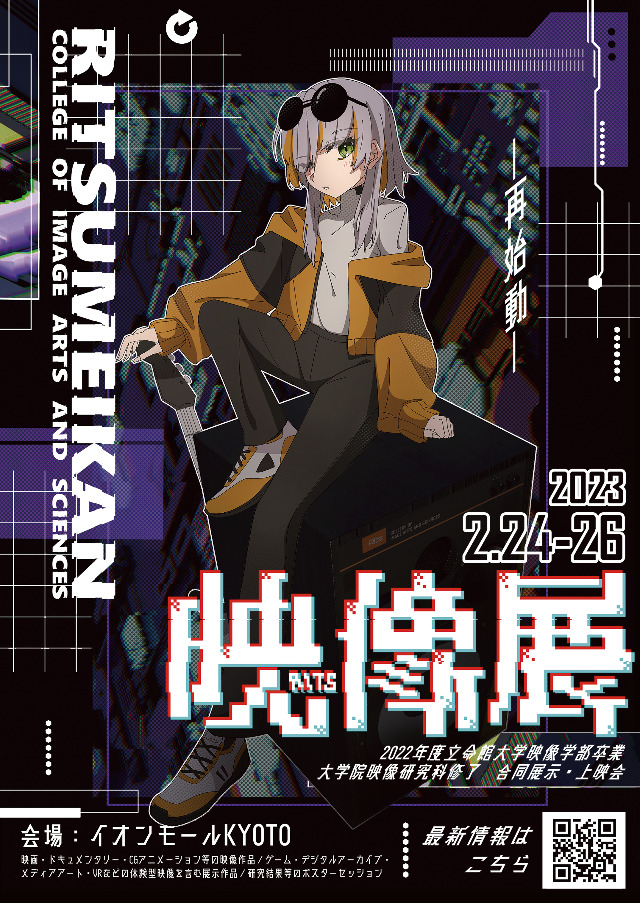

---

title: "卒業制作作品『図形楽譜を用いた音楽インタフェースのデザインと演奏"
tags: "archive"
update: 20231123

---

# 卒業制作作品『図形楽譜を用いた音楽インタフェースのデザインと演奏』

# はじめに

学部の卒業に際しての制作/研究で、私は視覚的なインタフェース（GUI）を図形楽譜として捉える演奏のためのソフトウェアを作りました。この資料は、卒業作品の展示に関する情報や、作成した作品に関する解説や研究を簡易にまとめたものです。また、本作品の公開に寄せて、研究内容を簡易にまとめたものを執筆しました。

作者: 松本太一

所属機関: 立命館大学映像学部映像学科　

e-mail: taichimatsumoto360@gmail.com

twitter: [https://twitter.com/braveeeeen](https://twitter.com/braveeeeen)

soundcloud: [https://soundcloud.com/braven-music](https://soundcloud.com/braven-music)

私について: [松本太一：ポートフォリオ](https://docs.google.com/document/d/19VMNqB1e5t4moHdwJUnN5Ap-6s0kgxovPP17klL5Olo/edit?usp=sharing)

---

# 卒業制作の展示

卒業制作は2つの形態で展示します。一つは、デジタル上の環境にて閲覧することができるデジタルエキシビションです。主に、制作した作品を用いたパフォーマンスの記録と作成した作品のソースコードを展示します。二つは、私が所属している学部の卒業展示会「立命館大学映像展」での実地展示になります。そこでは、音楽インタフェースそのものを展示します。実際に作成した音楽インタフェースを実際に触って演奏していただけます。

## デジタルエキシビション

**パフォーマンスの記録映像**

[https://youtu.be/torxCXoCfh4](https://youtu.be/torxCXoCfh4)

**ソースコード**

[https://github.com/aveeeeen/Musical-Interface-as-a-Graphic-Score](https://github.com/aveeeeen/Musical-Interface-as-a-Graphic-Score)

## 立命館大学映像展

2/25(Sat),2/26(Sun),11:00-18:00イオンモール京都、4F Kotoホールにて開催、展示を実施。

詳細: [https://www.ritsumei.ac.jp/cias/exhibition2023/](https://www.ritsumei.ac.jp/cias/exhibition2023/)

---

# 作品公開に寄せて

コンピューターを用いた音楽パフォーマンスを考えた際に、演奏者は情報処理を視覚的に比喩した表現を頼りにすることが多いでしょう。DAWやその内部で動作するプラグイン、はたまた、少し変わったインタラクションを介するライブコーディングなどでもそうですが、私達音楽家が画面なしで音を発することは困難を極めます。

あらゆる感覚器官があるなかで、音楽を発する操作を行う上で視覚の必要性に縛られるデジタル環境での音楽パフォーマンスは不思議な対象です。この疑念については、コンピューターが介在しない音楽パフォーマンスと比較するとわかりやすいでしょう。楽器は物理的な支持体が音を鳴らす上での操作面となるので、視覚がなくとも触覚と聴覚だけで演奏が可能です。はじめて視覚が必要になるのは、音楽パフォーマンスに楽譜が導入されるときです。一方で、コンピューターを用いた音楽パフォーマンスでは演奏に際しては、楽器のように触覚と聴覚だけでは完結せず、視覚的なインタラクションが必要になります。

このように画面を通したインタラクションによって成立するコンピューターを用いた演奏で、私が似通っていると感じたのが楽譜です。広い括りで楽譜を言い表せば、それは音楽的な情報を視覚的に表現したものです。であるならば、音楽的な行為をする上でそれに必要な情報が視覚的に表される画面と楽譜に連続性を見いだすことができるのではないでしょうか。そこで、視覚的なインタフェースそのものを楽譜、記譜法として捉えることができるのではないかという関心が卒業作品を作る動機を形成しました。

本作品を作るにあたっては楽譜の中でも、抽象的で様々な解釈が可能な「図形楽譜」に焦点を当てました。作品解説の「図形楽譜とは何か；デジタルの演奏環境と楽譜の連続性を考察する上での補助線」の節でも紹介しますが、図形楽譜はコンピューターを用いた音楽パフォーマンスと同様に演奏の瞬間に呼応するインタラクションを提供します。研究において、最初は図形楽譜がその言葉どおり、言語のような記号ではなく、抽象的な図形によって音楽を伝達するがためにこれを研究対象にしました。しかし、図形楽譜の性質を調べるうちにそれが音楽パフォーマンスにおける画面を通したHCIを考えるための有効な視座を提示することがわかりました。ご覧になる皆様に、演奏における画面とは何か、画面における音楽的な表記とは何か、を一緒に考えていただければ幸いです。

---

# 作品解説

## 制作した音楽インタフェースの概要と研究の狙い

この作品は、画像を読み込み、画像の画素を音楽的な要素へとマッピングすることで演奏を実現するソフトウェアだ。fig.1が制作した音楽インタフェースの画面である。ユーザーは読み込んだ画像の画素を特定の範囲で循環する機構、いわば、電子楽器のシーケンサーのようなものを配置し、操作する。また、画像そのものの色味を変化させる。この２つの操作で演奏が実現される。

.png)

fig.1 卒業研究に際して作成した音楽インタフェースを演奏している様子

本作品単体では音を鳴らすことができない。しかし、本作品は同時に演奏のシステムが成立する上での主要な節である。このソフトウェアは音楽をあらゆる面でそれと接する人へと接続する境界面（Interface）として働いている。演奏を実現するための境界面という理由より、NIME（New Interface for Musical Expression）より着想を得て本作品を音楽インタフェースとして位置づけている。

この作品で基軸となるテーマは画面に表示される視覚的なインタフェースを図形楽譜として捉えることにある。図形楽譜とは、五線譜などとは異なり、作曲家が楽曲に応じて独自の記譜法を用いて音楽を演奏家へ伝える楽譜のことをいう。fig.2（Earle Brownによる『December 1952』）や、fig.3（Morton Feldmanによる『Projection 1』）は図形楽譜の例である。図形によって音楽のコミュニケーションを行う図形楽譜と音楽インタフェースにおける画面上の表示は一見非常に似ている。しかし、それは形式的に似ているだけである。本研究では、図形楽譜の性質を考察することにより、図形楽譜とこの作品の連続性を測ることを目的におく。

.png)

fig.2 Earle Brown 『December 1952』

.png)

fig.3 Morton Feldman 『Projection 1』

また、本研究では演奏においてユーザと観客にとってわかりやすい視覚的なインタフェースはどのようにしてデザインされるかを探求することを目的におく。プロトタイピング中、本作品のデモンストレーションを行ったところ、ソフトウェアが発する音楽的な出来事と画面に表示されるものとの対応関係がわからないという指摘があった。これを端に、ユーザーへ演奏をわかりやすく伝えるための視覚的なインタフェースをデザインするという課題が浮上した。本研究では、「マッピングの透明性」という観点からこのようなソフトウェア上の動作と発せられる音の対応関係を表現する上で有効なデザインを模索する。

## 図形楽譜とは何か；デジタルの演奏環境と楽譜の連続性を考察する上での補助線

図形楽譜とは何かという問いについては形式的に前章にて説明した。それは、作曲家が楽曲に対して個別的な記譜法を用いた楽譜という非常に抽象的な答えだ。ここでは、図形楽譜と本作品のような画面を通したHCIによって演奏が実現するNIMEとの繋がりを掴む上での手がかりを提示する。そのために図形楽譜についてもう少し掘り下げてみたい。

私が本研究において分析した先行事例の図形楽譜は1950年から1970年にかけて前衛的な音楽活動を行なったニューヨーク楽派と呼ばれる人たちによって作成されたものが多い。彼らの活動における主義の一つに五線譜による再現のための音楽から離反する「偶然性」や「即興性」を含む音楽の実現がある。図形楽譜について考察する上でのレンズとして、それが「偶然性」や「即興性」を音楽に組み込むための方法として捉えることを起点にしてみよう。

先ほどの議論より、まずはじめに図形楽譜は楽曲を記録のためのものではないといえる。五線記譜法による楽譜は言語のような記号を解釈する上での規範が存在し、それゆえに記号とその意味内容には堅固な対応関係がある。そのため、五線譜は楽曲を記録する。また、五線譜に書き起こされた楽譜は再現のための記述であるともいえるだろう。図形楽譜はまず、楽譜を通して再現を行おうとしない。そのため、図形楽譜を用いた音楽パフォーマンスでは、その都度演奏時の出来事が異なる。図形楽譜は再現のための楽譜ではなく、モメントを生み出すための楽譜なのだ。図形楽譜によって記譜される音楽は演奏より先行して存在するのではなく、演奏の瞬間に現れる。

では、図形楽譜における楽譜の機能とは何か。それは、演奏家に音楽的なコミュニケーションをする上でのデザインされたオブジェクトに近いといえる。図形楽譜は演奏家に「即興性」や「偶然性」を演奏に導入するための材料としてインスピレーション（後述する演奏家にとっての「刺激」）を差し出す。そうして感受される抽象的なものは演奏家に恣意的な音楽表現を導く素材となる。それと同時に、演奏をある一定の方向に導くための規範を編み合わせるのだ。このように、規範と自由をある度合いで混在させるために、図形楽譜はその作者によってデザインされている。

上で述べられた図形楽譜の二つの特徴、「モメントを生み出すための楽譜」、「音楽的なコミュニケーションをする上でのデザインされたオブジェクト」は音楽のための視覚的なインタフェースと相まみえる交点となるのではないだろうか。例えば、電子音楽やラップトップ音楽のパフォーマンスを想像してもらうと良い。そこにおける音楽的なコミュニケーションを行う視覚的な媒体は常に現在を示しており、媒体にある制約とその外のユーザーによる選択がデザインされたオブジェクトとして折り合わされている。

## 本作品と図形楽譜の連続性

紙面上に記譜される図形楽譜と本作品のようなデジタルな環境で演奏が行われる音楽インタフェースの間にはどういった連続性があるのだろうか。これを分析するにあたっては、紙面上に書かれた図形楽譜とNIME等の学会誌で自身の作品を図形楽譜と形容する音楽インタフェースを先行事例として分析した。そこから導かれた本作品と図形楽譜の連続性を示す性質は3つある。

### 音楽表現を導くうえでの制約

分析した図形楽譜には「偶然性」や「即興性」を実現するために演奏者に恣意的な音楽表現を任せる一方で、演奏家をある一定の演奏へと導くために音楽表現上の制約があることが確認された。このような制約は本作品にも存在し、それは古典的な図形楽譜と同様に音楽的なコミュニケーションが行わる媒体にデザインされている。本作品における制約は、画像をソフトウェアに読み込むことで、画像を音楽的な要素へと変換する仕組みや、読み込み範囲に応じてリズムが決定する仕組みのように音楽インタフェースにプログラムされた演奏上の規範である。

### 演奏者にとっての刺激

図形楽譜には、演奏者がそこにある抽象的なイメージを解釈し、演奏へ反映するための刺激として機能する性質がある。刺激は「偶然性」や「即興性」を求める図形楽譜において、演奏家が音楽表現を生み出す源泉となる。演奏者は図形楽譜にある規範ではないものから刺激を受け、それによって音楽表現を定位する。この刺激の性質は本作品の画像に見受けられる。先行事例で分析した図形楽譜同様に、本作品の画像は刺激として演奏者ごとに主観的に解釈され、それが表現される音へ反映される。

### 理解のためのインタフェース

これは、分析した先行事例の中でも、本作品のように、GUIに表示されるものを図形楽譜として捉えている音楽インタフェースに確認された性質だ。例えば、fig.4のThor Magnussonが作成した『Threnoscope』という音楽インタフェースは、ソフトウェア上の動作を視覚的に表示するものを指して「図形楽譜」と呼んでいる。本作品でも同様に、音を鳴らす仕組みを視覚化する「理解のためのインタフェース」としての性質が存在する。

.png)

fig.4 Thor Magnusson 『Threnoscope』

## 視覚的なインタフェースのデザイン

デジタルな音楽表現の媒体では、音楽的な出来事と動作機構の対応関係が問題にされており、これを「マッピングの透明性」という言葉で議論されている。本作品において、わかりやすい視覚的なインタフェースをデザインするということは、このマッピングを透明にすることに等しい。マッピングを透明にする上で、本作品では、視覚的なインタフェースに「メタファー」と「人の心身特性を考慮したデザイン」を用いている。

### メタファーを用いたインタフェースデザイン

「メタファー」はデジタル上の動作を私たちにとって直感的に理解可能な既成の概念に関連づけられる形で表現することだ。本作品においては、シーケンサーの動作範囲を表す部分を枠や縁に見立てる「フレーム」のメタファーと画素を読み取る動作をライフルの照準器に見立てる「サイト」のメタファーを用いている（fig.5とfig.6を参照）。これらのデザインは、音楽インタフェースの動作をより直感的に提示することでマッピングを透明にしようとする。

(a).png)

fig.5 「フレーム」と「サイト」のメタファーを用いたシーケンサの視覚表示

(b).png)

fig.6 「サイト」のメタファーを用いた画素値のマッピングの視覚表示

### 心身特性を考慮したインタフェースデザイン

私たち人間の知覚や認知には限界がある。それらの限界に対応するデザインが人の心身特性を考慮したデザインだ。本作品では、シーケンサーの最大動作数を4つに制限した。これは人の短期記憶に配慮したデザインであり、ソフトウェア上で起きる出来事の把捉に役立てるためにあえて情報量を抑えている。また、本ソフトウェアにおける状態表示を特定の色で表現するカラーコーディングを用いている（fig.7を参照）。色で状態の表現をまとめることで、状態の認知を促進する。

.png)

fig.7 カラーコーディングによって色で状態をまとめて表現する状態表示